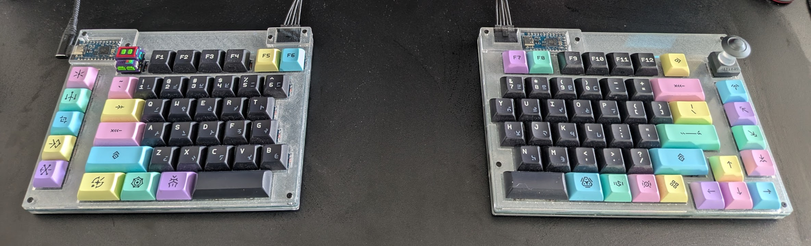

### Meet the Thresher Shark Horizon, a split keyboard (plus optional numpad) for Gateron low profile keyswitches, with a couple of unique features.

The name comes from one of my favourite animals, the thresher shark, a creature endowed with a permanent facial expression that can only be described as "why is existence happening to me":

and my favourite video game series, Horizon Zero Dawn/Horizon Forbidden West. Since the general approach to naming a keyboard design seems to be "throw a dart at a dictionary", this seemed as good as anything.

The TSH keyboard has a couple of design choices that set it apart:
- It uses Gateron low profile switches, which are a lot less commonly supported in the custom keyboard space than other switch types.
- It mostly uses a full standard ANSI key layout, somewhat rare among split keyboards.
- It has an electrically coupled split spacebar (see below for what that means).
- It uses a Molex Micro-fit cable to connect the split halves rather than a TRRS (see below for why).

The TSH numberpad, meanwhile: 
- Is a separate, optional unit that needs its own USB connection.
- Has a built-in OLED screen and can function as a standalone 4-function calculator.

All three parts are "sandwich" designs using layers of laser-cut acrylic. The only part that needs a different fabrication approach is the switch plate - see details in the building section below.

### Electrically coupled split spacebar: what and why?
The TSH uses what I call an "electrically coupled split spacebar" design. What that means is that the two halves of the spacebar are connected directly to each other via two extra conductors in the cable between the two keyboard halves. Because of this, the keyboard firmware actually *sees them as a single key*.

I designed the keyboard this way because I have a habit of slamming both my thumbs down on the spacebar at once, and I didn't want to risk that with a split layout that might lead to lots of accidental double-spaces. I could have fixed that in software somehow, but this was a cleaner solution. If you're not a double-space-slammer, you won't notice any difference at all, *except* for the fact that the right spacebar "doesn't exist" in software, so it can't be reassigned to another function.

### Molex Micro-fit connectors: what and why?
The two halves of the TSH are connected with a Molex Micro-fit 3.0 5-pin cable. There are two main advantages of this connector over the TRRS jacks that are traditionally used in split keyboards:

First, the connectors are parallel, so the cable is hot-plug-safe (TRRS cables, because the various contacts pass through in sequence when you connect them, are usually NOT hot-pluggable because you will end up inadvertently dumping voltage somewhere you don't want it).

Second, Micro-fit connectors are crimped rather than soldered, so putting together your own cable with custom sleeving should be easier. Pre-built cable assemblies are also readily available.

### Compatible parts and bill of materials
The TSH is designed for Gateron low profile switches. You can also use Numphy-branded low profile switches, which are made by Gateron to the same dimensions.

You'll need a microcontroller board for each half, and a third for the numberpad if you decide to build that as well. It's designed for the [Elite-Pi](https://keeb.io/products/elite-pi-usb-c-pro-micro-replacement-rp2040), but there's no reason I know of the slightly older Elite-C wouldn't work.

### Fabrication and building

This section is coming soon :)

### Software
The TSH is designed for use with [KMK](https://github.com/KMKfw/kmk_firmware), a keyboard firmware built on top of CircuitPython. I think QMK would also work, but I could never get it to install on any of my RP2040 boards, so this hasn't been tested.

If you want the calculator function on the numpad, use [my fork of KMK](https://github.com/robotfishe/kmk_firmware). Be warned that I do not keep this up to date with the upstream build....but it's a keyboard, so if it works, it works, right?
